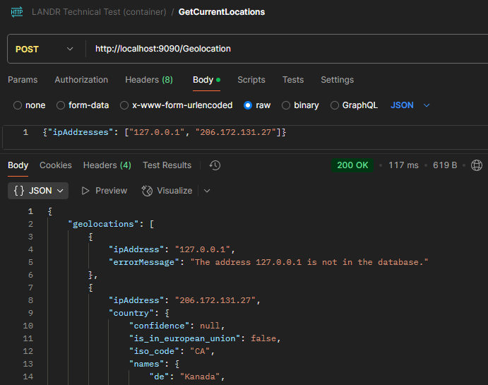

# LandrTechnicalTest

## Build status
[](https://github.com/dannyhorodniczy/LandrTechnicalTest/actions/workflows/build.yml)

## Description

To run the app , ensure that you have [Docker Desktop](https://www.docker.com/products/docker-desktop/) installed on your machine.


1. Navigate to the root of the repo and build an image + run a container with the following commands:
```
docker build -t geolocation-service-image -f WebApi/Dockerfile .
docker container run -d --name dannys-geolocation-service -p 9090:8080 geolocation-service-image
```
Note: if port 9090 is already in use, you can change the port number in the second command, i.e, `-p my_available_port:8080`.

2. Using your favourite API testing software, you can now GET and POST to `http://localhost:9090/Geolocation`

Note: When POSTing, you are required to pass the IP addresses with the following JSON in the body:
```
{
    "ipAddresses": [
        "127.0.0.1",
        "206.172.131.27"
    ]
}
```

Here is an example of a POST request using [Postman](https://www.postman.com/):


If there is a problem obtaining geolocation data for any of your IP addresses, an appropriate HTTP status code and error message will be provided.